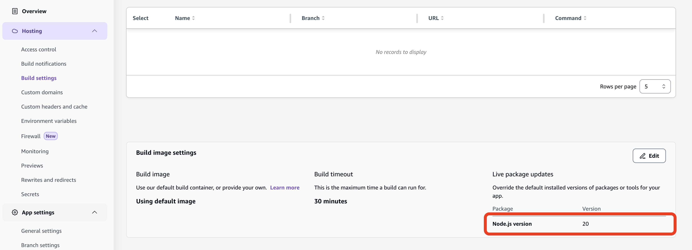

# Vite Plugin React Router Amplify Hosting

This package is vite plugin for React Router SSR on Amplify Hosting.

## Features

- Generate `deploy-manifest.json`.
- Generate and bundle a `server.mjs` as compute entrypoint file.
- Build the folder structure that Amplify expects for the deployment bundle.

## Get started

### Install

```shell
npm add -D vite-plugin-react-router-amplify-hosting
npm add compression express isbot morgan
```

## Usage

Include the Amplify plugin in your `vite.config.ts`:

```ts
import { defineConfig } from "vite";
import tailwindcss from "@tailwindcss/vite";
import { reactRouter } from "@react-router/dev/vite";
import tsconfigPaths from "vite-tsconfig-paths";
import { amplifyHosting } from "vite-plugin-react-router-amplify-hosting";

export default defineConfig({
  plugins: [tailwindcss(), reactRouter(), tsconfigPaths(), amplifyHosting()],
});
```

The `baseDirectory` should be `.amplify-hosting`.
`baseDirectory` is `.amplify-hosting`.
Your build settings file should look like the following.

```yaml
version: 1
frontend:
  phases:
    preBuild:
      commands:
        # vite-plugin-react-router-amplify-hosting requre Node.js v20 or later
        - nvm install 20
        - nvm use 20
        - "npm ci --cache .npm --prefer-offline"
    build:
      commands:
        - "npm run build"
  artifacts:
    baseDirectory: .amplify-hosting
    files:
      - "**/*"
  cache:
    paths:
      - ".npm/**/*"
```

This plugin require Node.js v20 or later.
You need to install Node.js v20 or later using nvm in `amplify.yml` or specify 20 for the Node.js version in the Amplify Hosting build image settings as shown below.



## License

This package was created under the [MIT License](LICENSE).
